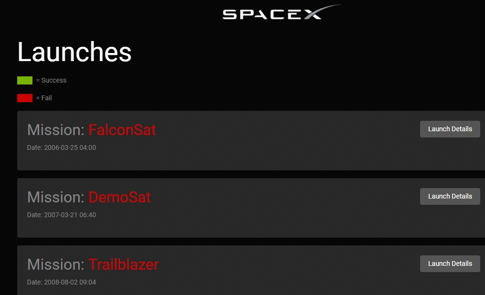

# spacex-dashboard-graphql-apollo

Demo repository to implement graphql, apollo. New concepts learnt using this course:
- Creating graphql server using express-graphql
- ApolloClient and querying graphql schema
- Running client & server via single command using concurrently
- Using proxy prop in package.json
- Bootstrap

Other items refreshed:
- react-router
- classNames
- moment

## Resource used
https://www.youtube.com/playlist?list=PLillGF-RfqbZrjw48EXLdM4dsOhURCLZx

## Sandbox URL
https://codesandbox.io/s/github/fraindz/real-chat-application

## Deployed at
https://csb-o96wv3x595-yfkwzzkhhm.now.sh/

## App Demo

